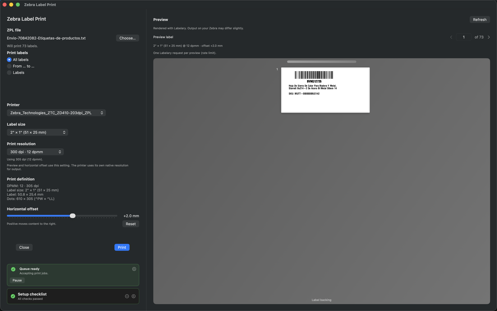

# How to print labels on Mac with Zebra printers — free ZPL app for macOS

**Zebra Label Print** is a free, open-source **macOS app to print label files on Zebra thermal printers** — ZD410, ZD420, ZD620, GK420d, ZT series, and any other Zebra model that appears in **System Settings → Printers & Scanners**. Open a **ZPL** (Zebra Programming Language) file, preview the label, and send it to your printer through **CUPS**. Built for **Apple silicon Macs** (macOS 13+).

If you searched for **how to print labels with Zebra printers on Mac OS**, **print ZPL on Mac**, or **Zebra printer macOS setup**, you are in the right place: install [Zebra’s official CUPS driver](https://support.zebra.com/article/Install-CUPS-Driver-for-Zebra-Printer-in-Mac-OS?redirect=false), add the printer queue in macOS, then use this app for day-to-day **shipping labels**, **barcode labels**, and **warehouse labels** — no Windows PC or virtual machine required.

**[Download Zebra Label Print for Mac (DMG)](https://github.com/kingbeto/zebralabelprint/releases/latest)** · [Releases](https://github.com/kingbeto/zebralabelprint/releases) · [Source & build notes](TECHNICAL.md)



## How to print labels on Mac with a Zebra printer

Follow these steps to print **ZPL label files** from a **Mac** to a **Zebra thermal printer**:

### 1. Install the Zebra CUPS driver on macOS

Zebra requires their **macOS CUPS driver** before any app (including this one) can print. This is Zebra’s requirement, not something Zebra Label Print installs.

→ [Zebra: Install CUPS Driver for Zebra Printer in Mac OS](https://support.zebra.com/article/Install-CUPS-Driver-for-Zebra-Printer-in-Mac-OS?redirect=false)

### 2. Add your Zebra printer in System Settings

Open **System Settings → Printers & Scanners** and add your Zebra printer (USB, Ethernet, or Wi‑Fi). macOS registers it as a **CUPS print queue**.

Verify from Terminal:

```bash
lpstat -a | grep -i zebra
```

Example when setup is correct:

```
Zebra_Technologies_ZTC_ZD410-203dpi_ZPL accepting requests since ...
```

Confirm CUPS is running:

```bash
lpstat -r
```

You should see `scheduler is running`.

### 3. Download and install Zebra Label Print

Download **[ZebraLabelPrint-arm64.dmg](https://github.com/kingbeto/zebralabelprint/releases/download/v1.2.0/ZebraLabelPrint-arm64.dmg)** (v1.2.0), open it, and drag **ZebraLabelPrint.app** to **Applications**.

On first launch, macOS may block the app because it is not signed by Apple. Right-click the app → **Open** → **Open** again, or allow it under **System Settings → Privacy & Security**.

### 4. Open your label file and print

1. Launch **Zebra Label Print** (the file picker opens automatically).
2. Choose a `.zpl` or `.txt` file — the content must be **ZPL** (`^XA` … `^XZ`); the extension is only for convenience.
3. Select your **Zebra printer** from the dropdown (the app remembers it and auto-picks a queue whose name contains “zebra”).
4. Review the **live preview** on the right and the **setup checklist** at the bottom of the sidebar.
5. Click **Print**.

The app sends **raw ZPL** to CUPS (`lpr`), the same way ERP systems, shipping platforms, and Zebra Design Studio export labels.

**TL;DR** — [Zebra CUPS driver](https://support.zebra.com/article/Install-CUPS-Driver-for-Zebra-Printer-in-Mac-OS?redirect=false) → add printer in System Settings → download DMG → open ZPL file → **Print**.

## Supported Zebra printers on Mac

Works with any Zebra model that macOS exposes as a CUPS queue after you install Zebra’s driver, including common desktop and industrial printers:

| Series / models | Notes |
|-----------------|-------|
| **ZD410**, **ZD420**, **ZD620** | Popular 2″ and 4″ desktop label printers |
| **GK420d**, **GK420t** | Legacy desktop models still widely used |
| **ZT230**, **ZT410**, **ZT610** | Industrial thermal transfer |
| **ZQ** mobile series | When added as a macOS printer queue |

If `lpstat -a | grep -i zebra` lists your printer, Zebra Label Print can send jobs to it.

## Features

- **Print ZPL on macOS** — send label jobs to CUPS; accurate counts for multi-label files and `^PQ` copies
- **Print label selection** — print all labels, a from/to range, or a macOS-style list (`1, 10, 15-20`); always visible with hints when disabled
- **Live label preview** — render any label via [Labelary](http://labelary.com) before you print (one request at a time; rate limits apply)
- **Print resolution** — Auto (from printer name), 203 / 300 / 600 dpi for preview, offset, and DPMM display
- **Setup checklist** — CUPS, Zebra driver, printer queue, and “ready to print” in one place
- **Printer queue controls** — pause, resume, and cancel pending jobs from the sidebar
- **Horizontal offset** — fix labels that print slightly off-center (millimeter slider)
- **Printer wake-up refresh** — polls up to 15 seconds after power-on so status turns green
- **Remembers** printer, label size, print resolution, and offset between launches

## Requirements

- **macOS 13** (Ventura) or later — **Mac OS** printing through CUPS
- **Apple silicon Mac** (M1 or later). Intel Macs are not supported in the pre-built DMG; see [TECHNICAL.md](TECHNICAL.md) to compile yourself.
- [Zebra CUPS driver](https://support.zebra.com/article/Install-CUPS-Driver-for-Zebra-Printer-in-Mac-OS?redirect=false) installed
- Zebra printer added in **System Settings → Printers & Scanners**

## Using the app

1. Review the **setup checklist** (bottom of sidebar). It collapses when all checks pass.
2. Under **Print labels**, choose **All labels**, **From … to …**, or **Labels** (`1, 5, 10-20`). Disabled until the file has more than one printable label.
3. Set **Label size** and **Print resolution** if preview or alignment look wrong.
4. For multi-label files, use **Preview label** (◀ ▶) to check any label before printing.
5. Use the **queue banner** to pause, resume, or cancel jobs if needed.

The summary under the file name shows how many labels will print for your selection.

## Print labels

| Option | Meaning |
|--------|---------|
| **All labels** | Every expanded label in the file |
| **From … to …** | Contiguous range (e.g. 5 through 20) |
| **Labels** | macOS-style list: `1`, `10`, or `1, 5, 10-20` |

Enabled only when the file has **more than one** printable label. Otherwise the section stays visible with a hint (“Choose a ZPL file first.” or “This file contains only one label.”).

## Preview and alignment

- Preview needs an internet connection (Labelary). Output on the physical printer may differ slightly.
- **Label size** sets preview proportions (default 2″ × 1″).
- **Print resolution** affects preview and offset math, not what the printer outputs natively.
- **Horizontal offset** (mm) shifts content left/right when labels print off-center; saved automatically.

## Frequently asked questions

### How do I print labels with Zebra printers on Mac OS?

1. Install [Zebra’s CUPS driver for macOS](https://support.zebra.com/article/Install-CUPS-Driver-for-Zebra-Printer-in-Mac-OS?redirect=false).
2. Add the printer in **System Settings → Printers & Scanners**.
3. Download **Zebra Label Print**, open your `.zpl` or `.txt` ZPL file, and click **Print**.

### How do I print ZPL files on a Mac?

Same steps as above. Zebra Label Print sends raw ZPL through CUPS — the standard way to print Zebra label files on macOS without Windows-only tools.

### Does this work with Zebra ZD410, ZD620, GK420d, and other models?

Yes, when macOS lists the printer in CUPS (`lpstat -a | grep -i zebra`). The app does not care about the model name; it prints to whichever Zebra queue you select.

### Can I print Zebra shipping labels or barcode labels on Mac?

Yes. Any label exported as **ZPL** — from Shopify, WooCommerce, ERP/WMS systems, or custom software — can be opened and printed. Preview helps verify barcodes and layout before you waste labels.

### Can I print only some labels from a multi-label ZPL file?

Yes. Use **Print labels** → **All labels**, **From … to …**, or **Labels** with a list like `1, 5, 10-20`. The app expands `^PQ` copies so each physical label can be selected.

### Can I print `.txt` files that contain ZPL?

Yes. The extension does not matter; the file must contain valid ZPL (`^XA` … `^XZ`).

### Do I need Zebra Setup Utilities on Mac?

You need Zebra’s **CUPS driver** and a printer queue in macOS. Zebra Label Print is a lightweight tool for **printing and previewing ZPL** — it does not replace the driver installer.

### Zebra printer not printing on Mac — what should I check?

- Run `lpstat -a | grep -i zebra` — is the queue listed?
- Is the queue **paused**? Use **Resume** in the app or System Settings.
- Is CUPS running? (`lpstat -r`)
- Are labels loaded and is the printer online? Use **Refresh** in the app (polls up to 15 seconds after power-on).

### Is Zebra Label Print free?

Yes. Open source under [GPL-3.0](LICENSE). Download from [GitHub Releases](https://github.com/kingbeto/zebralabelprint/releases/latest).

### Why Apple silicon only?

The distributed DMG is **arm64** only. See [TECHNICAL.md](TECHNICAL.md) to build for other architectures from source.

## Troubleshooting

- **No printers listed** — Install [Zebra’s CUPS driver](https://support.zebra.com/article/Install-CUPS-Driver-for-Zebra-Printer-in-Mac-OS?redirect=false) and add the printer in System Settings.
- **Setup checklist stays red** — Expand for details; restart CUPS with ↻ if needed; wait on **Refresh** after powering the printer on.
- **Print succeeds but nothing prints** — Queue may be paused; **Resume** in the banner or System Settings.
- **Print labels disabled** — No file selected, still loading, or only one label in the file.
- **No preview** — Check internet; Labelary requests are paced (200 ms) to avoid rate limits.
- **File won’t open** — Ensure the file contains ZPL (`^XA` … `^XZ`), even with a `.txt` extension.

## For developers

Build instructions and architecture: [TECHNICAL.md](TECHNICAL.md). GitHub **description and topics** for search: [.github/REPOSITORY.md](.github/REPOSITORY.md).

## License

GPL-3.0 — see [LICENSE](LICENSE).

## Author

**Alberto Pardo Saleme** — [LinkedIn](https://www.linkedin.com/in/alberto-pardo-saleme/)
